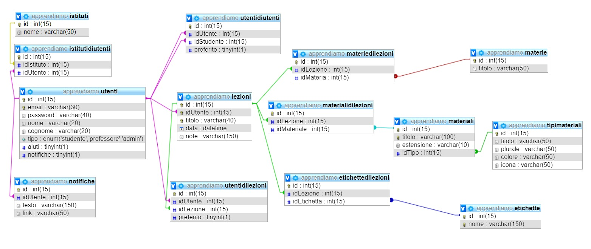

# App-prendiamoci

A partire dal 5/02/2019 il sito verrà hostato al indirizzo 93.49.97.47

<a href="http://93.49.97.47"> 93.49.97.47 </a>

### Avvio tramite XAMPP
 - copiare l'intero progetto in C:/xampp/htdocs/
 - importare in phpmyadmin il file **database/create.sql**
 - visualizzare la pagina web **localhost/App-Rendiamo/**

 

### Account di prova

<table>
  <tr><th>Username</th><th>Password</th><th>Permessi</th></tr>
  <tr><td>admin@root</td><td>qwerty</td><td>Admin</td></tr>
  <tr><td>docente@root</td><td>qwerty</td><td>Docente</td></tr>
  <tr><td>studente@root</td><td>qwerty</td><td>Studente</td></tr>
</table>

### Screenshots

